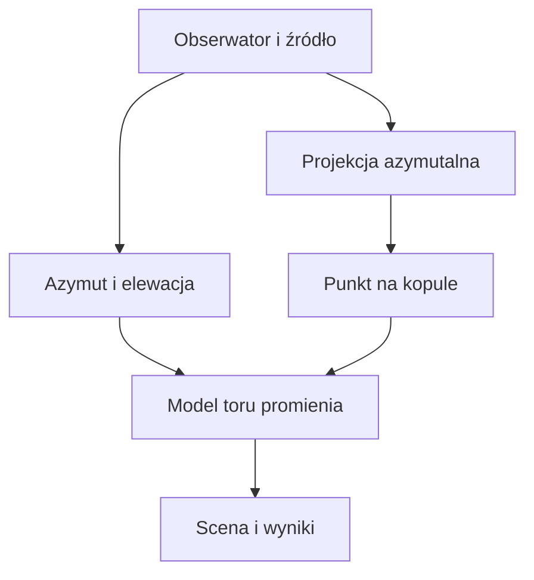

# Architektura modelu

## Cel

Kod rozdziela trzy rzeczy, które łatwo pomieszać w jednej demonstracji:

1. **Geometrię odwzorowania** — zamiana szerokości i długości geograficznej na współrzędne płaskiej mapy.
2. **Geometrię obserwacji** — azymut i elewacja źródła dla danego obserwatora.
3. **Prawo propagacji** — reguła, która wyznacza cały tor promienia.

Obecna krzywa Béziera dostarcza jedynie punktu odniesienia dla punktu 3. Nie wynika z równania pola ani z optyki ośrodka.

## Konwencje współrzędnych

- Jednostką obliczeń przestrzennych jest kilometr.
- Oś `Y` jest pionowa.
- Płaszczyzna mapy leży w `Y = 0`.
- Biegun północny leży w środku mapy.
- Promień mapy `20 015 km` odpowiada odległości od bieguna północnego do południowego w projekcji równodystansowej.
- Długość `0°` jest skierowana ku górze mapy w widoku z góry, a długości wschodnie biegną zgodnie z ruchem wskazówek zegara.
- Azymut jest liczony od lokalnej północy ku wschodowi: `0° = N`, `90° = E`.

## Przepływ obliczeń



## Moduły

| Moduł | Odpowiedzialność |
|---|---|
| `azimuthal.ts` | projekcja geograficzna i jej odwrotność |
| `horizontal.ts` | przejście z deklinacji i kąta godzinnego do azymutu i elewacji |
| `dome.ts` | powierzchnia elipsoidalnej kopuły |
| `baselineRay.ts` | bazowa krzywa Béziera zgodna z konstrukcją FE-Dome |
| `compute.ts` | spójne złożenie parametrów w wynik modelu |
| `SceneController.ts` | wyłącznie wizualizacja wyniku |

## Następny etap: pole toroidalne

Nowego modelu nie należy dopisywać bezpośrednio do sceny. Docelowy interfejs powinien przyjmować stan promienia i zwracać jego lokalną zmianę, na przykład:

```ts
interface PropagationField<Parameters> {
  acceleration(
    position: Vec3,
    direction: Vec3,
    parameters: Parameters,
  ): Vec3;
}
```

Integrator numeryczny będzie wtedy niezależny od konkretnego pola. Pozwoli to porównywać:

- tor prosty,
- konstrukcję Béziera Bislina,
- jeden lub więcej wariantów pola toroidalnego,
- standardowy model astronomiczny z refrakcją.

## Format przyszłych obserwacji

Minimalny rekord danych powinien zawierać:

```ts
interface Observation {
  id: string;
  timestampUtc: string;
  observerLatitudeDeg: number;
  observerLongitudeDeg: number;
  observerAltitudeM: number;
  target: string;
  measuredAzimuthDeg: number;
  measuredElevationDeg: number;
  azimuthUncertaintyDeg?: number;
  elevationUncertaintyDeg?: number;
  source?: string;
}
```

Niepewności są ważne: bez nich optymalizator może traktować pomiar przybliżony tak samo jak pomiar geodezyjny.

## Kryteria gotowości modelu pola

Przed dopasowaniem parametrów potrzebujemy:

1. jednoznacznej definicji torusa i jego osi,
2. wzoru pola lub współczynnika załamania w każdym punkcie,
3. warunków początkowych promienia,
4. ograniczeń jednostek i zakresów parametrów,
5. zestawu obserwacji treningowych i osobnego zestawu kontrolnego,
6. funkcji błędu liczonej na azymucie i elewacji.

Oddzielenie danych kontrolnych zapobiegnie znalezieniu parametrów, które dobrze odtwarzają wyłącznie przykłady użyte podczas strojenia.
