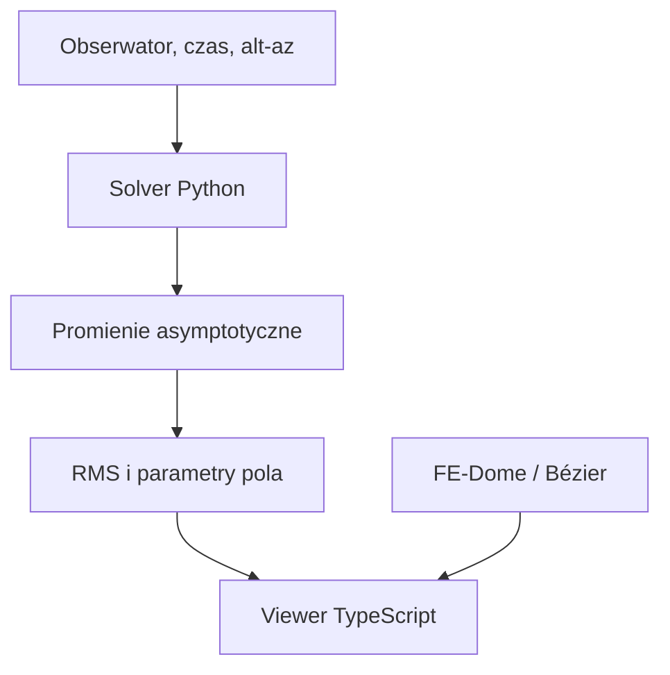

# Architektura modelu

## Cel

Kod rozdziela trzy rzeczy, które łatwo pomieszać w jednej demonstracji:

1. **Geometrię odwzorowania** — zamiana szerokości i długości geograficznej na współrzędne płaskiej mapy.
2. **Geometrię obserwacji** — azymut i elewacja źródła dla danego obserwatora.
3. **Prawo propagacji** — reguła, która wyznacza cały tor promienia.

Obecna krzywa Béziera dostarcza jedynie punktu odniesienia dla punktu 3. Nie wynika z równania pola ani z optyki ośrodka.

## Konwencje współrzędnych wizualizacji

- Jednostką obliczeń przestrzennych jest kilometr.
- Oś `Y` jest pionowa.
- Płaszczyzna mapy leży w `Y = 0`.
- Biegun północny leży w środku mapy.
- Promień mapy `20 015 km` odpowiada odległości od bieguna północnego do południowego w projekcji równodystansowej.
- Długość `0°` jest skierowana ku górze mapy w widoku z góry, a długości wschodnie biegną zgodnie z ruchem wskazówek zegara.
- Azymut jest liczony od lokalnej północy ku wschodowi: `0° = N`, `90° = E`.

## Dwie rozdzielone warstwy



## Moduły

| Moduł | Odpowiedzialność |
|---|---|
| `azimuthal.ts` | projekcja geograficzna i jej odwrotność |
| `horizontal.ts` | przejście z deklinacji i kąta godzinnego do azymutu i elewacji |
| `dome.ts` | powierzchnia elipsoidalnej kopuły |
| `baselineRay.ts` | bazowa krzywa Béziera zgodna z konstrukcją FE-Dome |
| `compute.ts` | spójne złożenie parametrów w wynik modelu |
| `SceneController.ts` | wyłącznie wizualizacja wyniku |

## Rodziny pola i propagacja

Model fizyczny nie jest częścią sceny. Archiwalny wariant `v1-falsified`
implementuje pole

```text
n(rho,z) = 1 + k exp(-z/H)
             + A exp(-((rho-rho0)^2 + z^2)/(2 s^2))
```

oraz równanie eikonalne parametryzowane długością łuku:

```text
r'' = (grad(n) - (grad(n) dot r') r') / n
```

Integrator prowadzi pełny promień 3D. Osiowa symetria zmniejsza liczbę zmiennych pola, ale nie ogranicza ogólnego promienia do jednego przekroju 2D.

`solver/field_lens.py` zawiera sferycznie symetryczne profile Maxwella i
Luneburga. Hybryda Luneburga ma status `v2-falsified-hybrid` po zamrożonym
skanie `(R,z0)`. Głównym kierunkiem jest dokładny Maxwell. Jego pierwszy
interwał obrazowania i warunek lustra są zaimplementowane analitycznie w
`solver/maxwell_mirror.py` jako wielkie okręgi na `S^3`, bez RK45. Zamknięty
układ lustrzany nie tworzy zewnętrznych asymptotycznych półprostych, więc jego
rekonstrukcja będzie minimalizować wspólne zbliżenie krzywych. Szczegóły:
[`MAXWELL_MIRROR_CONTRACT.md`](MAXWELL_MIRROR_CONTRACT.md).

TypeScript zachowuje kontrakt przyszłego importu pola do podglądu:

```ts
interface PropagationField<Parameters> {
  acceleration(
    position: Vec3,
    direction: Vec3,
    parameters: Parameters,
  ): Vec3;
}
```

Rozdzielenie pozwala porównywać:

- tor prosty,
- konstrukcję Béziera Bislina,
- archiwalne pole toroidalne v1 i soczewki gradientowe v2,
- standardowy model astronomiczny z refrakcją.

## Format przyszłych obserwacji

Minimalny rekord danych powinien zawierać:

```ts
interface Observation {
  id: string;
  timestampUtc: string;
  observerLatitudeDeg: number;
  observerLongitudeDeg: number;
  observerAltitudeM: number;
  target: string;
  measuredAzimuthDeg: number;
  measuredElevationDeg: number;
  azimuthUncertaintyDeg?: number;
  elevationUncertaintyDeg?: number;
  source?: string;
}
```

Niepewności są ważne: bez nich optymalizator może traktować pomiar przybliżony tak samo jak pomiar geodezyjny.

## Warunek brzegowy bez założonej kopuły

Położenie źródła i wysokość kopuły nie są wejściami solvera. Dla każdego obserwatora promień startuje w zmierzonym albo syntetycznie wyznaczonym kierunku alt-az. Integracja kończy się dopiero, gdy cały modelowany gradient jest zaniedbywalny. Następnie:

1. punkt i kierunek wyjścia definiują asymptotyczną półprostą,
2. wspólny punkt jest dopasowywany do półprostych wielu obserwatorów,
3. RMS najmniejszych odległości jest liczony osobno dla każdej chwili,
4. średni RMS wielu chwil jest funkcją kosztu pola.

Tryb nieskończonych prostych istnieje tylko do reprodukcji pierwotnego handoffu. Domyślne półproste nie pozwalają uzyskać pozornie dobrego przecięcia za obserwatorem.

## Konwencje wymiany danych

- viewer: `X/Z` to mapa, `Y` to wysokość,
- solver: `x/y` to mapa, `z` to wysokość,
- jednostka długości w obu warstwach: kilometr,
- każdy eksport solvera zapisuje nazwę układu współrzędnych.

## Warunki uczciwego testu

Przed mocnym wnioskiem potrzebujemy pełnego globalnego przebiegu, kontroli wyników na granicach parametrów, danych spoza zbioru strojącego oraz osobnych niepewności obserwacyjnych. Pole kończące na granicy dozwolonego zakresu nie jest jeszcze potwierdzonym rozwiązaniem.

Oddzielenie danych kontrolnych zapobiegnie znalezieniu parametrów, które dobrze odtwarzają wyłącznie przykłady użyte podczas strojenia.
